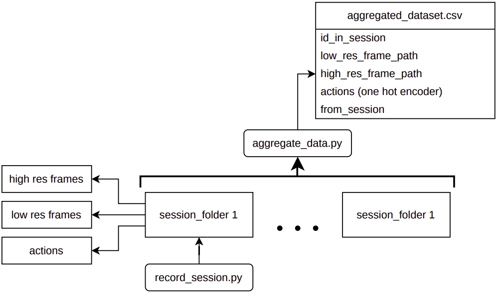
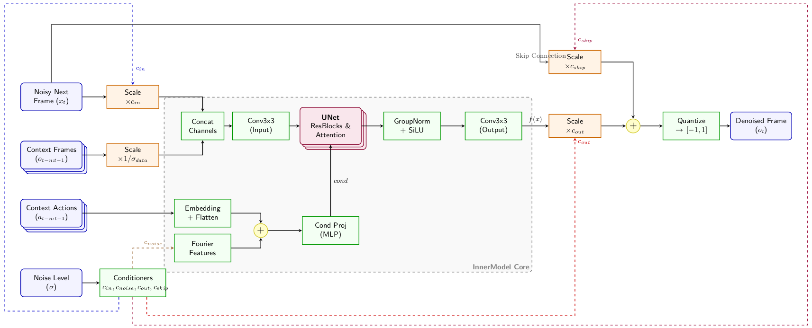
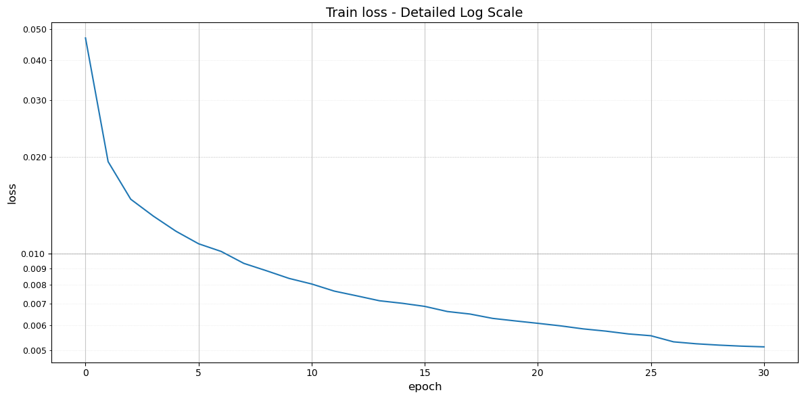
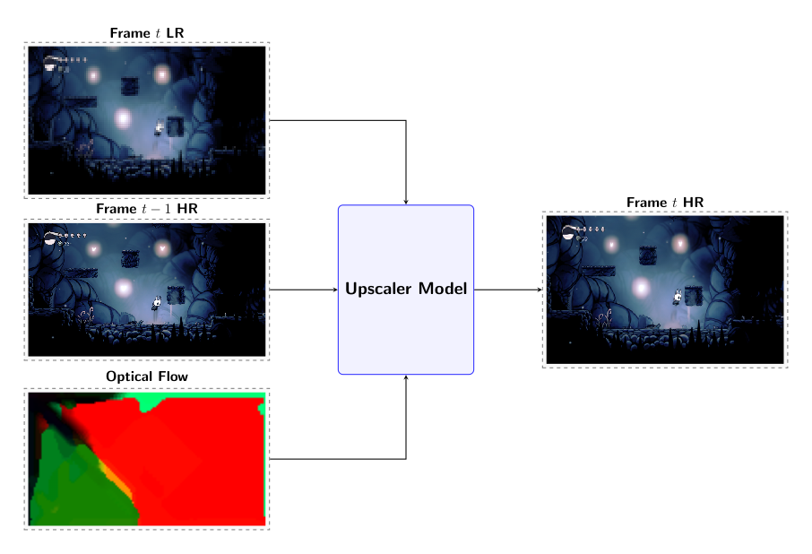
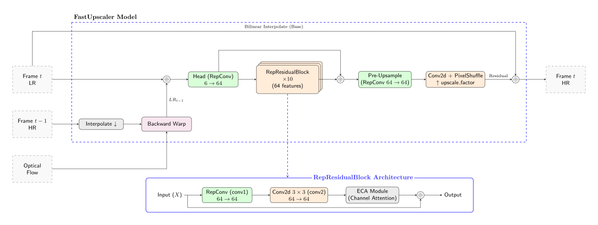
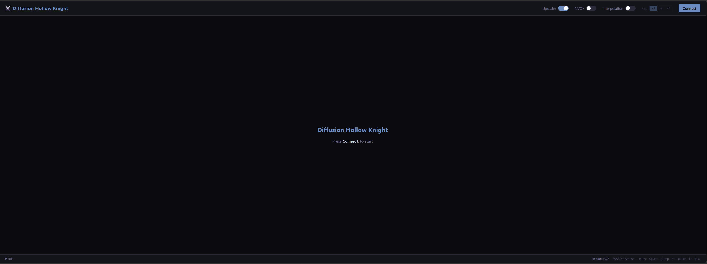
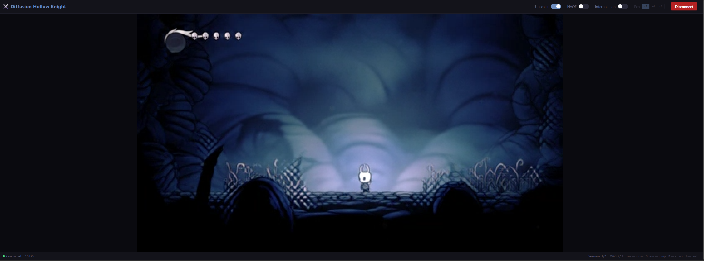

# Симуляция начала игры Hollow Knight при помощи диффузионной нейросети в реальном времени

## Введение
### Задача

Замена классического описания логики игрового мира и рендера, реализуемого при помощи заранее заданного кода, на большие генеративные модели (world models), способные предсказать следующие состояния мира по последовательности предыдущих наблюдений и действий агента. 

### Актуальность задачи

1) Разработка компьютерных игр представляет собой длительный и трудоемкий процесс, включающий в себя большое число итераций при проектировании игровых механик, уровней и технической составляющей игры.  На разработку прототипов уходит существенная часть времени от всего цикла разработки, при этом значительная часть созданных прототипов в дальнейшем не используется. Так, изначально, в Portal 2 порталы должны были отсутствовать, а головоломки были завязаны на использовании перспективы, но потом от этой идеи отказались. Существует довольно много примеров, когда фаза прототипирования и препродакшена растягивалась на долгие годы. Из таких примеров можно выделить, например, Skull and Bones, который в процессе разработки претерпел множество изменений игровой концепции, или Destiny, при разработке которой примерно за год до релиза решили не использовать большую часть уже имеющихся наработок, так же как и любую другую игру, прошедшую через производственный ад и не обязательно дошедшую до релиза (Prey 2 от Human head studios или Doom 4).   В перспективе, использование генеративных моделей в качестве основы для описания игровой среды может стать значимой парадигмой для разработки в игровой индустрии и значительно упростить этап прототипирования и  сократить время и ресурсы, затрачиваемые на разработку прототипов. 
2)  World models являются перспективным направлением решения задач в области обучения с подкреплением. Создание world models на основе экспериментальных данных может снизить стоимость сбора данных, ускорить обучение, а также позволить включить в обучение модели опыт, полученный в реальном мире, что позволит улучшить общее качество модели по сравнению с обычными RL моделями по типу DQN, что было явно показано в статье "Ha D., Schmidhuber J. World models //arXiv preprint arXiv:1803.10122. – 2018. – Т. 2. – №. 3. – С. 440.". 

### Имеющиеся решения

На данный момент исследования в области world models ведутся такими IT-гигантами как Google и Microsoft. В качестве примеров можно привести следующие работы:

GameNGen --- разработанная в Google world model для игры DOOM, основанная на модели stable diffusion v1.4. 
DIAMOND --- семейство world models для обучения RL-агентов, включающее в себя модели для игр Atari и модель для карты Dust 2. 
MUSE AI --- семейство world models от Microsoft, которое было применено для симуляции Quake 2. 
OASIS --- world model для игры Minecraft от Etched и Decart.

Эти работы показывают, что генеративные модели способны воспроизводить логику игрового мира и могут быть рассмотрены в качестве альтернативы классическому моделированию среды в отдельных задачах.
### Цель работы
Разработать world model для обучающей локации в игре Hollow Knight. 


## Сбор данных


Для обучения модели был собран собственный датасет.
Для этого был создан скрипт для записи экрана (`data_collection/aggregate_data.py`) с заданной частотой кадров (FPS) одновременно в двух разрешениях: высоком и низком. Это было необходимо для последующего использования данных как в модели генерации мира, так и в модели апскейлинга.

В процессе записи для каждого кадра сохранялись:
 - изображение сцены
 - временная метка кадра
 - нажатые клавиши, преобразованные в действия
 - временные метки нажатий

Для последующей обработки был реализован отдельный скрипт агрегации (`data_collection/aggregate_data.py`). Его основная задача заключалась в сопоставлении пользовательских действий соответствующим кадрам.

В ходе агрегации:
 - действия синхронизировались с кадрами по времени
 - выполнялось кодирование действий с использованием one-hot encoding
 - сохранялись пути к изображениям
 - фиксировался порядковый номер игровой сессии

Агрегированный датасет использовался для обучения модели генерации мира.


## Генерация игрового мира
### Датасет
Для обучения модели был собран датасет, содержащий около 40 000 кадров начальной локации игры Hollow Knight. Данные записывались с частотой 20 FPS и приведены к разрешению 128×72.

Выбор разрешения и частоты кадров был обусловлен требованиями к производительности модели. Пониженное разрешение позволяет существенно снизить вычислительную нагрузку, а фиксированный FPS обеспечивает стабильность временной динамики, что критично для генерации последовательностей в реальном времени.

Для работы с данными был реализован кастомный класс датасета (`training/dataset.py`), который выполняет следующие функции:
 - загрузка и нормализация кадров
 - загрузка и кодирование пользовательских действий
 - формирование временных окон (последовательностей кадров и действий)
 - генерация масок, используемых в процессе обучения

На выходе датасет возвращает согласованные по времени последовательности кадров, действий и соответствующая им маска, которые используются в качестве входных данных для модели.

### Архитектура модели


В качестве модели для генерации мира была выбрана архитектура DIAMOND, разработанная для задачи условной последовательной генерации кадров с учетом действий пользователя. Данная архитектура представляет собой облегчённую диффузионную модель, адаптированную для работы с временными данными и ориентированную на быстрый инференс. В процессе генерации следующего кадра модель использует диффузионный подход, в котором предсказание осуществляется через последовательное удаление шума.

На каждом шаге сначала сэмплируется уровень шума $\sigma$, на основе которого вычисляются коэффициенты кондиционирования (conditioners), включая $c_{\text{noise}}$, $c_{\text{in}}$, $c_{\text{out}}$ и $c_{\text{skip}}$. Эти коэффициенты используются в различных частях модели для стабилизации и масштабирования сигналов. Дальше проще разделить повествования на две независимые ветви: обработка действий (actions) и обработка кадров (frames). Для обработки действий окно проходит через слой эмбеддинга, после чего конкатенируется с фурье-признаками, полученными из $c_{\text{noise}}$. Данное представление проходит линейную проекцию и используется в качестве условного входа для U-Net. В это время для обработки кадров последовательность конкатенируется с зашумлённым будущим кадром. Полученный тензор проходит через свёрточный слой с ядром 3×3, после чего подается на вход U-Net.

В качестве основной архитектуры используется U-Net с модификациями: добавлены механизмы внимания на более глубоких уровнях, а так же используется AdaGroupNorm для интеграции conditioning-информации. Это позволяет эффективно объединять информацию о состоянии среды и действиях пользователя. Выход U-Net нормализуется и проходит через дополнительный свёрточный слой (3×3). Далее результат умножается на $c_{\text{out}}$ и добавляется скип-соединение с входным зашумлённым кадром, масштабированным на $c_{\text{skip}}$.

После выполнения нескольких итераций денойзинга получается итоговый кадр $x_{t+1}$.

Архитектура модели была адаптирована под задачу, в результате чего её размер был сокращён до ~15 млн параметров.

|Гиперпараметр|Значение|
|---|---|
|num_steps_denoising|3|
|num_steps_conditioning|4|
|cond_channels|128|
|depths|[2, 2, 2, 2]|
|channels|[32, 64, 128, 256]|
|attn_depths|[False, False, True, True]|


### Обучение
Полученная модель обучалась на собранном датасете с использованием батчей размером 8. Основной задачей обучения было достижение стабильной генерации последовательностей кадров, а не только отдельных изображений. Для этого модель обучалась предсказывать не один следующий кадр, а целые последовательности длины seq_len. При этом в процессе обучения использовался авторегрессионный подход: ранее предсказанные моделью кадры подавались обратно на вход для генерации следующих. Такой подход позволяет приблизить условия обучения к условиям инференса.
Основные параметры обучения:

|Параметр|Значение|
|---|---|
|dataset size|~40 000 sequences|
|batch size|8|
|optimizer|AdamW|
|learning rate|1e-4|
|scheduler|ExponentialLR|
|gamma|0.955|

Обучение происходило поэтапно с постепенным увеличением длины последовательности:

|Эпохи|seq_len|Этап|
|---|---|---|
|1|1|Warm up|
|2-25|20|Training|
|26-30|50|Long sequence learning|

На этапе *warm up* модель обучалась генерировать отдельные кадры, что позволяло ей выучить базовое распределение изображений без необходимости учитывать долгосрочные зависимости. Далее на этапе *training* модель переходила к генерации последовательностей длиной до 20 кадров (1 секунда симуляции). На этом этапе формировалась способность поддерживать краткосрочную временную согласованность. На этапе *long sequence learning* длина последовательности увеличивалась до 50 кадров. Основной задачей этого этапа было повышение устойчивости генерации и снижение накопления ошибок, возникающих при использовании собственных предсказаний модели в качестве входных данных.



Такой поэтапный подход к обучению позволил улучшить стабильность генерации и добиться согласованного поведения модели на длинных временных промежутках.


### Вывод по обучению


В результате была обучена модель, способная генерировать игровой мир Hollow Knight в реальном времени. Модель демонстрирует высокую скорость инференса — около 40 мс на кадр на GPU уровня RTX 3050 — и сохраняет стабильность даже при генерации длинных последовательностей.

В процессе обучения модель смогла усвоить ключевые элементы структуры игрового уровня, включая расположение секретных комнат, дверей, блокирующих продвижение игрока до их разрушения, а также опасностей, таких как шипы.

Несмотря на достигнутые результаты, модель имеет ряд ограничений: она работает в низком разрешении (128×72), обучена только на начальной части игры и в некоторых случаях демонстрирует артефакты, например появление фантомных объектов или врагов.


## Интерполяция

В качестве модели для интерполяции кадров было решено использовать легкую предобученную модель Practical-RIFE-4.25.lite, так как RIFE модели специально предназначены быстрой генерации промежуточных кадров. В таблице приведены значения наблюдаемый FPS и частота генерации мира (FPS) при разных режимах работы интерполяции (замеры производились без апскейлера):

| Интерполяция (кадры) | наблюдаемый FPS | частота генерации мира (FPS) | Время шага игровой петли |
| -------------------- | --------------- | ---------------------------- | ------------------------ |
| 0                    | ~20             | ~20                          | ~50 мс                   |
| 1                    | ~40             | ~19                          | ~55 мс                   |
| 3                    | ~60             | ~15                          | ~65 мс                   |
|                      |                 |                              |                          |

 Снижение частоты при интерполяции 3 кадрами частоты генерации до 15 FPS объясняется тем, что в текущей реализации интерполяция добавляет задержку между генерациями модели мира, равную $\tau=\text{interFrames} \times 5$ мс, что и приводит к соответствующему уменьшению частоты.
## Апскейлер

Поскольку для ускорения инференса диффузионной модели она работает в низком разрешении (LR) , чтобы пользователь видел всё-таки красивую картинку было принято решение создать быстрый апскейлер. Из самого нашего проекта выходят основные требования к апскейлеру
1. Upscaler должен быть лёгким и быстрым для нашего целевого fps это означает $\text{time to frame (ttf)} \le 15\text{ms}$.
2. Upscaler должен достаточно хорошо восстанавливать детали из весьма низкого разрешения (128×72).
3. Чтобы картинка была уже достаточно приятна глазу нужно делать апскейл минимум в четыре раза (x4).

Из требования 1 вытекает, что использование существующих опенсорсных решений нам не подходит, тк они сконцентрированны на Video Super Resolution (VSR) и поэтому достаточно большие и имеют $\text{ttf} \approx 50\text{ms}$. В добавок к этому, тк мы восстанавливаем из очень низкого разрешения, то для хорошего восстановления деталей нам нужно обучить или зафайнтюнить upscaler конкретно под нашу игру. 
Поэтому мы приняли решения обучить свой upscaler.


### Краткое описание

В качестве подхода был выбран классический в VSR подход к апскейлу кадра с использованием предыдущего кадра.



На вход модель принимает текущий LR кадр и предыдущий кадр в высоком разрешении (HR), выравненный с помощью оптического потока. На выходе — текущий HR кадр.

### Архитектура


Рассмотрим архитектуру модели подробнее.

Модель `FastUpscaler` построена по принципу **residual learning**: предсказывается не полное изображение, а остаток (residual) относительно билинейно увеличенного входа.

Архитектура состоит из следующих компонентов:

1. **Head** — `RepConv` блок, принимающий конкатенацию текущего LR-кадра и выравненного предыдущего LR-кадра (6 каналов → `num_feat` каналов).
2. **Body** — последовательность `RepResidualBlock` блоков с глобальным skip-соединением. Каждый блок содержит:
   - `RepConv` (расширение каналов) → `Conv2d 3×3` (сужение обратно) → `ECA` (Efficient Channel Attention).
3. **Pre-upsample** — ещё один `RepConv` для подготовки признаков.
4. **Upsample** — `Conv2d 3×3` + `PixelShuffle(4)` для увеличения пространственного разрешения.

**RepConv** (Re-parameterizable Convolution) — свёрточный блок, использующий при обучении три параллельные ветви (3×3, 1×1, identity + BatchNorm), которые при инференсе сливаются в одну свёртку 3×3 без потери точности. Это обеспечивает более богатое пространство обучения при нулевых дополнительных затратах на инференсе [RepVGG: Making VGG-style ConvNets Great Again, Ding et al., 2021].

**ECA** (Efficient Channel Attention) — лёгкий модуль канального внимания на основе 1D-свёртки по глобально пулированным признакам [ECA-Net: Efficient Channel Attention for Deep Convolutional Neural Networks, Wang et al., 2020].

**Optical Flow** — для выравнивания предыдущего кадра с текущим используется Nvidia Optical Flow (NVOF) 2.0 через OpenCV CUDA. Поток вычисляется на GPU с помощью аппаратного движка Nvidia, а обмен данными между PyTorch и OpenCV осуществляется через CuPy (DLPack). При отсутствии NVOF модель получает нулевой тензор потока.

|Гиперпараметр|Значение|
|---|---|
|num_feat|64|
|num_blocks|10|
|expansion|2|
|in_channels|6|
|out_channels|3|
|lr_size|72 × 128|
|hr_size|288 × 512|
|upscale_factor|4|

### Обучение

Обучение апскейлера проводилось на парах кадров низкого и высокого разрешения, полученных из записанных игровых сессий. Для каждой обучающей пары LR-кадр формировался из HR-опорного путём билинейного даунскейла, после чего к нему применялась аугментация в виде случайных JPEG-артефактов (30%), гауссова шума (20%) и размытия (20%), что повышало робастность модели к входным искажениям.

Ключевая особенность обучения — авторегрессионный подход на последовательностях кадров. Вместо независимой обработки каждого кадра модель обучалась генерировать следующий HR-кадр с использованием предыдущего предсказания в качестве контекста. Для обеспечения временной согласованности между кадрами применялся аппаратный оптический поток NVOF: предыдущий кадр выравнивался с текущим по вычисленному потоку, после чего Charbonnier-разница между выровненным предсказанием и целевым кадром добавлялась к общей функции потерь как temporal consistency loss.

Обучение проводилось в два этапа с динамическим расписанием весов функций потерь. На первых 60 эпохах использовался только Charbonnier Loss — это позволило модели сфокусироваться на пиксельной точности базовой реконструкции. На последующих эпохах к нему добавлялись perceptual, edge, FFT и temporal лоссы, что улучшало визуальное качество и согласованность границ. Для стабилизации обучения длинным последовательностям применялся teacher forcing: с вероятностью, плавно возрастающей от 0.0 до 0.4, вместо ground-truth кадра модели подавался предыдущий предсказанный кадр.

Модель обучалась на 10K последовательных кадров. И обучение заняло ~24 часа на GPU RTX 4070.

Основные параметры обучения:

|Параметр|Значение|
|---|---|
|model size|~1.6M параметров|
|batch size|8|
|optimizer|AdamW (lr=5×10⁻⁴, weight_decay=10⁻⁴)|
|scheduler|CosineAnnealingLR|
|epochs|250|
|sequence length|5 кадров|
|teacher forcing|линейное увеличение с $0 \rightarrow 0.4$|
|gradient clipping|max_norm=1.0|


### Лоссы

Для обучения апскейлера используется взвешенная комбинация нескольких функций потерь, управляемая менеджером `WeightedLossManager` с поддержкой расписания весов по эпохам.

- **Charbonnier Loss** (вес 1.0) — робастная альтернатива L1, гладкая в нуле: $\mathcal{L} = \sqrt{(x - y)^2 + \varepsilon^2}$. Обеспечивает стабильную пиксельную реконструкцию без чрезмерного сглаживания [Deep Laplacian Pyramid Networks for Fast and Accurate Super-Resolution, Lai et al., 2017].

- **Perceptual Loss** (вес 0.15) — L1-расстояние между признаками VGG-19 (слои `conv3_4` и `conv4_4`). Штрафует за несовпадение высокоуровневой структуры, что улучшает визуальное качество [Perceptual Losses for Real-Time Style Transfer and Super-Resolution, Johnson et al., 2016].

- **Sobel Edge Loss** (вес 0.1) — L1-расстояние между картами границ, полученными свёрткой с ядрами Собеля. Поощряет чёткость контуров, что критично для 2D-графики с выраженными контурами персонажей и платформ [A Multi-Level Supervision Model: A Novel Approach for Thermal Image Super Resolution, Chudasama et al., 2020].

- **FFT Loss** (вес 0.05) — L1-расстояние в частотной области (логарифм амплитуды 2D RFFT). Помогает восстанавливать высокочастотные детали и текстуры [Focal Frequency Loss for Image Reconstruction and Synthesis, Jiang et al., 2021].

- **Temporal Consistency Loss** (вес 0.05) — Charbonnier-разница между текущим предсказанием и выровненным предыдущим кадром. Предыдущий HR-кадр подвергается backward warp по оптическому потоку (NVOF) для совмещения с текущим, после чего вычисляется пиксельная ошибка. Обеспечивает согласованность границ и текстур между последовательными кадрами, снижая мерцание и дрожание в видеопоследовательностях.

### Результат


В результате обучения была получена компактная модель апскейлера размером ~1.6M параметров, демонстрирующая высокую скорость инференса — менее 3 мс на кадр на GPU уровня RTX 4070. Модель успешно восстанавливает мелкие детали игровой графики, включая контуры персонажа, текстуры платформ и элементы окружения, сохраняя при этом временную согласованность между кадрами.

Так как модель оказалась значительно быстрее, чем планировалось, то в дальнейшем можно увеличить размер модели и/или коэффициент апскейла. Вне зависимости от размера модели реальный тест с кадрами, генерируемыми диффузионкой, показал, что желательно после основного обучения зафайнтюнить модель под апскейл кадров именно от диффузионки, чтобы улучшить робастность апскейлера к артефактам генерации.

## Серверная часть (Backend)

Серверная часть реализована на FastAPI с использованием aiortc для WebRTC-соединения. Основная задача — запуск AI-пайплайна и передача видеопотока клиенту в реальном времени. При каждом шаге игровой сессии выполняется последовательная обработка: диффузионная модель генерирует LR-кадр на основе контекста и действий пользователя, апскейлер увеличивает разрешение до 512×288 с использованием оптического потока, интерполятор генерирует промежуточные кадры для повышения FPS, после чего результат кодируется и отправляется через WebRTC. Каждое соединение создаёт отдельную игровую сессию с собственным состоянием, предусмотрены лимиты на количество одновременных сессий и автоматическая очистка при разрыве соединения.

## Клиентская часть (Frontend)

Клиентская часть реализована на Vue 3 с TypeScript и Tailwind CSS. Интерфейс состоит из трёх основных компонентов: панели управления с переключателями апскейлера, NVOF и интерполяции, игрового экрана для отображения видеопотока и захвата клавиш, а также строки состояния с информацией о FPS и статусе соединения. При загрузке страницы клиент запрашивает конфигурацию сервера для определения доступных возможностей. После установки WebRTC-соединения видеопоток отображается в элементе `<video>`, а пользовательский ввод и настройки передаются на сервер через data channel в формате JSON. Если NVOF недоступен на сервере, соответствующий переключатель автоматически деактивируется.

### Скриншоты фронтенда



## Развёртывание (Docker)

Проект развёртывается с помощью Docker Compose. Предусмотрены два варианта базового образа для бэкенда:

1. **Full** (`Dockerfile.base`) — OpenCV, собранный из исходников с поддержкой CUDA, NVOF и cupy. Необходим для использования аппаратного оптического потока. Время сборки ~30 мин.
2. **Lite** (`Dockerfile.base.lite`) — стандартный `opencv-python-headless` из pip. NVOF недоступен, апскейлер работает в режиме zero-flow. Время сборки ~2 мин.

Оба варианта собираются в один и тот же тег `dhk-opencv-base:latest`, поверх которого строится быстрый app-образ (`Dockerfile`).

```bash
# Вариант 1: с NVOF (долгая сборка)
make build-base

# Вариант 2: без NVOF (быстрая сборка)
make build-base-lite

# Запуск всех сервисов
make up
```

Для обеспечения WebRTC-связи между браузером и контейнером на Docker Desktop для Windows используется TURN-сервер (coturn), который ретранслирует медиатрафик в обход NAT-ограничений виртуальной машины Docker.

## Вывод

